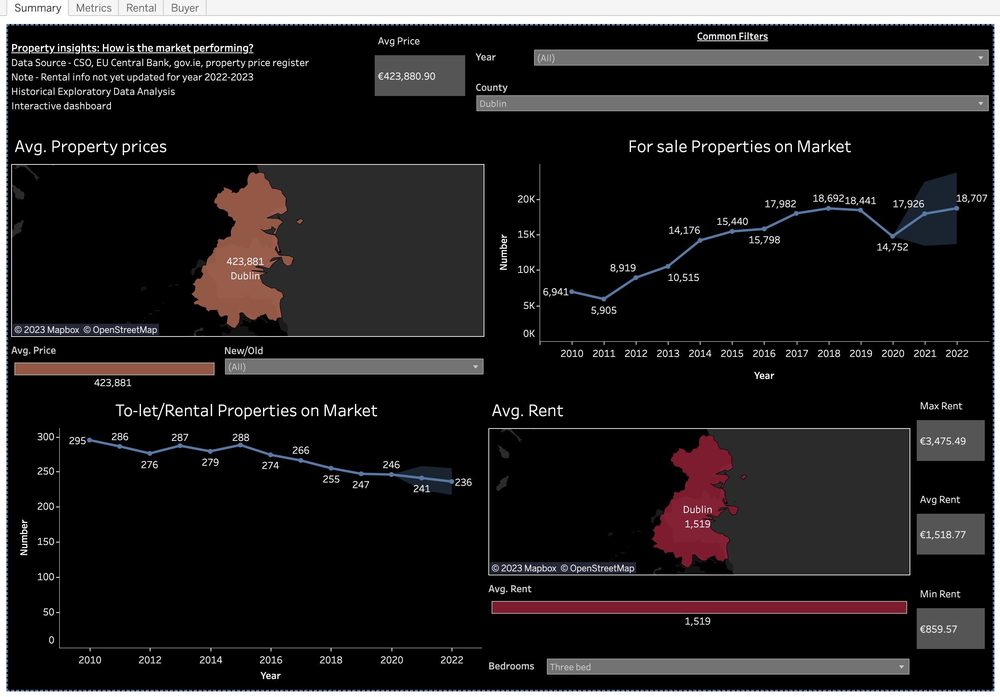
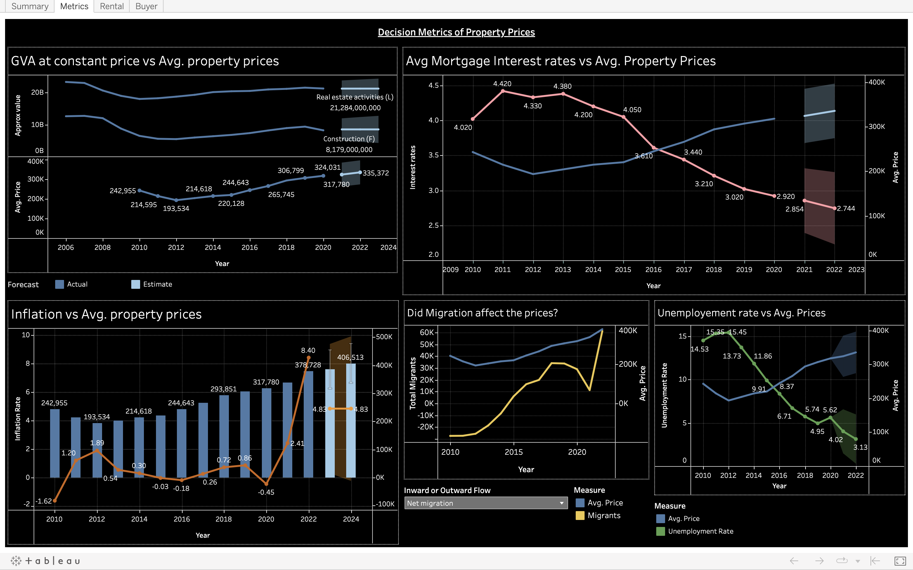
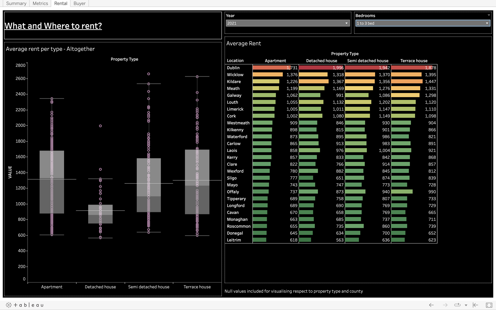
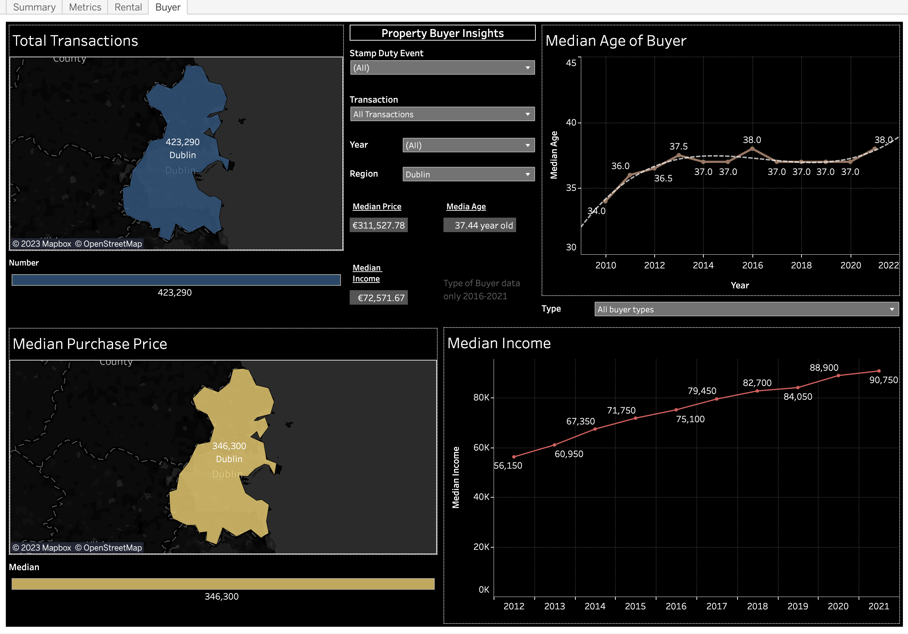

# Exploratory Data Analysis: Real Estate Market Trends in Ireland (2010-2021) tl;dr 

  

This project is an exploratory data analysis of the real estate market trends in Ireland from the year 2010 to 2021. The purpose of this analysis is to provide insights into the performance of the Irish real estate market over this period, and to identify any notable trends or patterns that may be of interest to potential buyers, investors, renters or other stakeholders in the industry.

## Data Source

The data used for this analysis was sourced from Central Statistics Office (CSO), one of the largest online statistics platforms in Ireland, gov.ie, property price register and EU Central Bank. 

The dataset pulled from <b> property register </b> includes information on around 600,000 property listings over the period from January 2010 to December 2023. Rest other datasets from CSO and EU Central Bank include data from 2010-2021 of: 

* Rental properties
* Buyers demographics
* Gross Value added
* Population
* Migration
* Unemployement Rates
* Interest rates
* Income
* Inflation rates 

These datasets were chosen to find out how such economic and geographical metrics influenced property and rental prices in the Irish market.

## Data Exploration

The data was first cleaned and preprocessed to ensure that it was ready for analysis. This involved removing any duplicate entries, handling missing values, and converting the data into a more usable format.

Once the data was cleaned, a series of exploratory data analysis (EDA) techniques were used to examine the trends and patterns in the data. This included the use of descriptive statistics, data visualization, and time-series analysis.

For this project I used SQL and Excel for exploring all the data in hand.

## Data Cleaning and Transformation

Using SQL and Excel, the datasets were queried to find out any abnormalities or duplicate values. 

### Some key relevant Excel transformations used

* Fetching County names from a variety of Addresses
* Left and right formula transformation
* Adding year column with Year Funtion
* TRIM values 
* Using VLOOKUP funtion to add Region field based on County names
* Correcting Datatypes
* Deleting irrelevant fields and rows
* Currency modifications 
* Translating Irish phrases to English
* Excluding data before 2010
* INDEX and FILTER data
* Concatenate relevant datasheets 
* Find and replace values

### SQL Querying 

Using the query language most of the transforamtions, extraction and manipulations were handled.

This [sql file](code.sql) contains few of the relevant queries used for this analysis project. SQL commands like JOIN ON, UPDATE, PARTITION BY, GROUP BY, ORDER BY, DELETE, etc helped in general manipulation tasks.

## Data Visualisation 

Link to the tableau Dashboards:

https://public.tableau.com/app/profile/suryansh.jamwal/viz/RealEstateAnalysis-Ireland/Summary

### How to navigate?

* Summary - Dashboard 1

Displays median property and rental prices in Ireland and respective counties for each year. 

Common filter for each visual - Year and County

Avg. Property price and number of for sale properties can be queried according to property standard (new/second-hand).

Avg. Rent and number of rental properties can be distinguished on total bedrooms.

  

* Metrics - Dashboard 2

Insight on different decision metrics for property prices.

Inward or outward flow queries total imgrants and emmigrants. 

  

* Rental - Dashboard 3

Common filters are Year and number of bedrooms.

Dashboard fisplays average Rental prices for each property type in different Counties.

  

* Buyer - Dashboard 3

Buyer demographics include age, income and price of property purchased. 

Common filter include Stamp Duty Event, Transaction Type, Region ad Year.

Avg. Income and age of buyers can be queried on type of buyer (with/without child).

  

## Market Summary 2010 - 2021

### For-Sale Property

* Average property price (Ireland) - €277,918

* Average price range -  from €104,239 in County Longford to €423,880 in County Dublin

* Prices increased by an average rate of 3.03% over the years. Median market prices increased by 39.3% from 2010 - 2021.

* Total For-sale properties on market increased at a rate of 13.47% over the years.

* Most affordable county to buy a property - Leitrim

### Rental properties

* Average Rent (Ireland) - €983.45

* Rental price range - €233.67 to €6522.48

* Most affordable (per renter) rental category - 1 to 3 Bed

* Most affordable property type : Ireland - Detached House; Dublin - Apartment

* Most affordable county to rent - Leitrim

## Key Takeaways

* There was a slight dip in average prices from 2010 - 2012, however overall property prices increased dramatically over the 11 year period at a rate of 3.03% on average.

* Similarly, the average rental price in the country increased from €799.4 in 2010 to €1,269.9 in 2021 at a rate of 4.26% on average. 

* With increased prices, the total number of for-sale properties also increased dramatically. However, number of rentals since 2012 has slighly decreased as more landlords are willing to sell instead of renting. When the maintenance costs and LPT are much higher than the rental income, landlords tend to exit the market.

* As usual the net migration, population, GDP and uemplyement has a direct affect on the property prices, which has been a contributing factor here as well. 

* Median age of Buyers has increased from 35yo in 2010 to 39yo in 2021, making it difficult for youngsters to barge in the market even when the national median income per person increased. Nonetheless, median age of buyers without children has decreased over the years. Having less dependants surely has created more opportunities and capital for youngsters to buy a property.

 

